# Table of Contents
- [System Introduction](#system-introduction)
- [System Specifications](#system-specifications)
- [Hardware Setup](#hardware-setup)
- [Development Environment](#development-environment)
- [Development Introduction](#development-introduction)
- [API](#api)
  * [Frequently Used Component](#frequently-used-component)
  * [ARCamera](#arcamera)
  * [Tag Tracker](#tag-tracker)
  * [Marker Identity](#marker-identity)
  * [Bench Marker](#bench-marker)
  * [Dynamic Marker](#dynamic-marker)
- [Advanced SDK Guide](#advanced-sdk-guide)
  * [Concept and Components](#concept-and-components)
  * [ARCamera](#arcamera-1)
  * [Marker Target](#marker-target)
  * [Start From Scratch](#start-from-scratch)
  * [Customized Build Preset](#customized-build-preset)

# System Introduction

> Wonderland is an augmented reality system that enables rich 3D interactions with a headset and cuztomizable interactive controller devices. 
>
> 
> 

**图1. 头戴显示器和交互设备示例**

> Wonderland头戴显示设备，基于**反射自由曲面光学**设计，可更换式的**强磁吸镜片**，自主研发的**反畸变算法**，全透视双目立体显示，实时同步的运动显示，异步时间的扭曲算法，提供**低延时**、**高稳定**、**高清晰**、**大视场**的显示效果。

**图2. 大视场显示示例**

> Wonderland的交互设备通过**高通835的SLAM**提供头部6DoF跟踪和**自主研发的x-Tag交互系统**实现灵活World
> Anchor式的虚实空间定位、任意组合式的组件操控交互、同步式多人互动协作。
>
> 

**图3. World Anchor虚实实间定位示例**

> 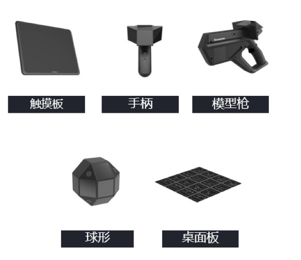
>
> **图4. 组合式组件操控示例**
>
> 
>
> **图5.同步式多人互动协作示例**
>
> Wonderland的x-Tag交互系统，通过一套基于单目和Marker的6DoF跟踪系统，实现高抗干扰、高识别率、低成本、易维护、高可用、易携带的灵活输入跟踪。不同形状的Marker，可以用在不同的特殊场景。
>
> 
> 
> 

**图6. 稳定跟踪示例**

**图7. 较便易携带示例**

> Wonderland
> AR系统为医疗、教育、实训、娱乐等垂直行业，提供稳定、高效、互动的行来解决方案，以提升行业效率。

**图8. 医疗行业应用示例**

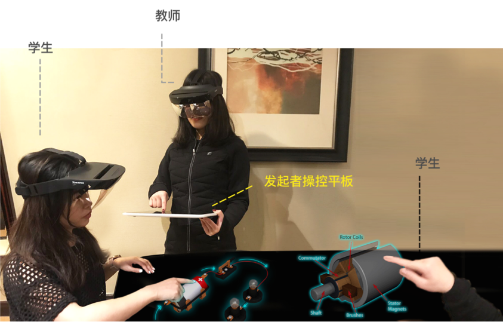

**图9. 教育行业应用示例**

**图9. 实训行业应用示例**

**图10. 娱乐行业应用示例**

# System Specifications

> Wonderland系统是以头戴显示设备为基础，以可自定义交互设备为拓展，以网络为多机互联工具的综合应用协作系统，下面对该系统的硬件、软件、系统特性进行简要介绍。

2.1 硬件特性

Wonderland系统主要硬件包括头戴显示和自定义交互设备。表1是头戴显示设备的硬件特性：

*外形参数*   *320 X 184 X 118mm ≤560g*
------------ ---------------------------------------------------------
主控         *高通骁龙835，八核 64位 CPU*
存储         *6G LPDDR4x + 64G flash（支持128G TF卡扩展）*
Sensor       *支持光线感应调解屏幕亮度*
*支持距离位置（佩戴）感应*
摄像头       *前置1300万高清自动对焦摄像头*
电池         *聚合物锂电池，3680mAh, 支持Quick Charge™，续航1个小时*
显示         *5.5寸 LCD，分辨率1440\*2560*
音频         *双喇叭，定制音腔*
*支持兼容CTIA/OMTP 4段3.5mm耳机插孔*
*双数字硅麦，支持语音识别*
Wi-Fi        *2.4 GHz/5 GHz，802.11 ad/ac/a/b/g/n*
蓝牙         *BT 5.0*
卫星定位     *GPS卫星定位*
跟踪定位     *双6DOF空间定位，VIO&Marker跟踪*
*头部6DOF跟踪定位*
*控制器6DOF跟踪定位*
*博世九轴传感器*
按键         *音量+、-、Power/Home、确认*
镜片类型     *单次反射，自由曲面，HFOV 50°，VFOV 57°*
防护等级     *IPX4*

**表1. 硬件特性**

2.2 软件特性

-   Android 7.1

-   Qualcomm QVR service 3.0,

-   Qualcomm SVR SDK 2.0.3

-   异步时间扭曲（Asynchronous TimeWarp）双目渲染

-   单一缓冲绘制（SingleBuffering）和跟踪预测（Tracking
Prediction）降低延时算法

-   自由曲面反畸变（Undistortion）算法，降低视觉畸变

-   快速入门的Unity SDK

-   开源场景化的开发Demo

2.3 系统特性

-   单机多设备应用系统。

-   多机本地协作系统

-   多机远程协作系统

-   云平台资源共享系统

# Hardware Setup

3.1 硬件说明1

Wonderland系统的包装硬件组成包括：头戴式显示设备（HMD）、自由曲面镜片（Lens）、空间定标（Beacon）、操作控制器（Controller）、附件（充电器、充电线、额头泡棉、眼镜布、说明书等）。系统还支持更多的自定义设备，需要额外采购。

**图1. 硬件设备装箱图**

Wonderland系统硬件使用过程如下：

1.  首先拿到机器以后，根据硬件列表，确认硬件完整性。

2.  取出头戴显示设备HMD，假如HMD额头泡棉过大，可以拿出额头泡棉，撕掉双面胶，贴到HMD额头位置，以更换成小的泡棉。

3.  取出镜片Lens，将镜片装配到HMD屏幕前的位置，镜片采用磁吸附的模式，会自动吸附到相应位置。

4.  取出控制器Controller，打开控制器后盖，取出电池仓内的电池挡片，使得电池启作用。盖上后盖，装上6DoF跟踪模块。

5.  拿出空间定标Beacon，放置于桌面上或地上，以适配不同的应用。

6.  如果HMD电量不足，可使用充电器和充电线（Type C），对HMD进行充电。

7.  如果需要通过PC连接HMD，可以使用充电线（Type
C）作为数据线，进行PC端的连接。

8.  配置好硬件设备，即可以启动HMD，进入软件系统使用。

9.  进入系统后，开启相应的应用，即可以将HMD配戴到头部，通过头戴旋扭，调整HMD的位置，以适应眼睛的视野。

10. HMD的具体的接口功能如图2所示。

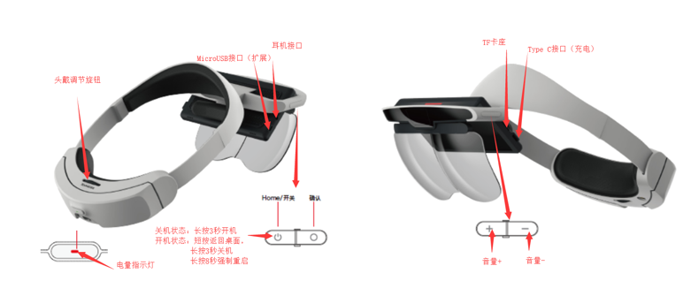

**图2. 头戴显示设备（HMD）功能示意图**

3.2 系统说明

> Wonderland系统的HMD长按开机按钮3秒，启动HMD，HMD在经过系统自检后，会进入到Android系统，Android系统最后会启动到自定义的Launcher界面（具体的硬件工作状态的转换关系，如图3所示）。
> 
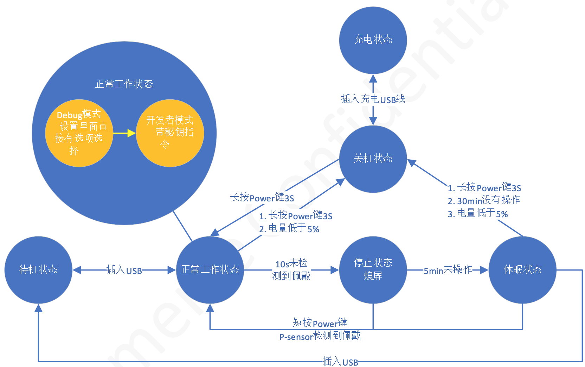
**图3.HMD系统状态图**

> 进入到Launcher后，可以通过Launcher，对系统各主要功能进行使用和配置管理，Launcher有两种模式，头瞄模式和手柄操控模式，在没有手柄连接的情况，可以使用头瞄，选择Launcher中的图标，通过短按确认按钮进行确认，通过Home按钮回到Home界面。在有连接手柄的情况下，可以通过按钮下左手柄或右手柄的扳机，进入手柄操控模式，手柄操控模式下，头瞄模式会被屏蔽。具体与开发相关的功能介绍如下：

1.  应用的查看、打开、卸载

> 在Launcher界面中心，有一个应用显示区域，可以选择显示在HMD前面的左右图标，进行不同应用的切换，应用在安装到系统内后，即会在应用区域显示；通过单击图标进行应用的打开；长按图标，会弹出卸载按钮，可以单点按扭进行应用的卸载。

2.  WiFi、蓝牙功能的配置和使用

> 在Launcher的WiFi和蓝牙的使用方式，可以通过头瞄或手柄的方式，选择功能按钮进行开关。WiFi功能打开后，会显示搜索到的WiFi热点，点击需要加入的WiFi热点，如果无密码，则加入WiFi，如果需要密码，则弹出虚拟键盘进行输入，点击确认后，加入该WiFi，对于已连接的WiFi，点击后，会出现遗忘的按钮，可按该按钮进行WiFi遗忘。同理，蓝牙的配对过程，如果无需输入密码，只需要正常配对，则直接连接；如果需要输入密码，则输入密码后进行配对连接。

3.  设备管理功能的配置和使用

> Launcher的设备管理功能包括设备的配对、连接、使用和遗忘。Wonderland的设备包括左右手柄Controller、Cube控制器、TouchPad等。
>
> Launcher的设备配对采用设备类型配对和按钮配对方式实现设备的自动配对连接。Launcher进入配对界面，点击所需要配对的设备，例如左手柄配对、右手柄配对、Cube配对等。点击后，系统进入配对模式，与此同时，通过同时点击手柄上的两个按扭，系统在检测到手柄按扭事件后，自动进行手柄的配对；手柄在配对成功后，系统会自动连接手柄。按下扳机，即可实现手柄操控Launcher的功能。如果想连接同种类型的其它手柄，需要先遗忘先前的手柄，在Launcher中，点击已连接手柄的图标，会出现遗忘的按扭，点击后会立即断开连接，删除选中的手柄配对文件，可以重新进行配对连接。

4.  系统资源更新功能

> 系统资源更新包括Rom更新、VPU更新。对于Rom更新，有新的更新，系统会弹出Rom可更新的按钮，点击该按钮后，系统会直接下载Rom的Update
> Patch，并进行OTA系统更新。VPU有更新时，系统会弹出VPU可更新的按钮，点击该按钮，系统会下载VPU更新包，进行VPU更新。

3.3 应用说明

> 应用APP开发好后，通过USB线和ADB工具（另外可以使用Visor），将APP安装到该系统中，安装完成后会在应用显示界面中显示相应的应用图标。由于不同的应用所需要的权限不一致，需要通过系统权限配置去配置应用的权限，直接通过Visor使用系统的权限配置方法。

# Development Environment

4.1 开发硬件环境

4.2 开发软件环境

# Development Introduction

# API

本章节主要以程序开发的角度阐述说明SDK 中脚本、组件的功能。

## Frequently Used Component
--------

介绍在SDK 场景中会出现并且使用的组件。

## ARCamera
--------

AR Camera组件主要用作于配置代表头显的的渲染显示以及旋转姿态。

-   Head
Mode用于配置头部旋转模式。static代表摄像机不更新旋转信息；RotateLocally代表摄像机每帧会根据IMU更新旋转头部信息。默认值是RotateLocally。

-   Rendering
Mode用于配置摄像机的渲染显示模式。Stereo代表摄像机的渲染会分成两个摄像机渲染成左右两个屏幕的画面。Single代表不分屏渲染，只在当前的Camera的位置进行渲染。

-   EyeCovergenceMode用于配置在Stereo模式下，两个摄像机相交位置。Infinity代表两个摄像机的方向是平行的。Cross
Plane代表两个摄像机会在前方向一定距离处相交。

## Tag Tracker
-----------

Tag Tracker组件主要用于配置该Camera的Tracking Profiles，指明该AR
摄像机能识别追踪的Marker信息。

-   Tracking
Profiles在[[上文]{.underline}](README.md)中我们提到了头戴设备能追踪一个单Marker或多个Marker的组合追踪目标，根据不同的应用场景开发者会使用到不同的硬件，Tracking
Profiles就是用于分辨不同硬件追踪目标的数据文件，**在一个Profile中不能包含有相同ID
的Marker**。

## Marker Identity
---------------

Marker Identity用于管理Marker Target所对应的Marker/Marker Group
ID以及本身的能见度。

Marker ID 这个这段可以填写单Marker 的ID 字段，或是组合Marker的 Marker
Group ID 字段。

## Bench Marker
------------

Bench Marker 可以理解为传统意义上的地面，用于代表坐标系的原点。

Bench Marker
所建立相对坐标系是基于与AR摄像机的相对姿态变换而来的，因此Bench
Marker本身的姿态会对这个坐标系产生影响。

我们以Bench Marker Match Scale
Content这个Demo场景为例子说应一下实际使用情况：

该场景中使用的是物理尺寸0.38m \* 0.38m的桌布(Map)组合marker，marker
id是34。

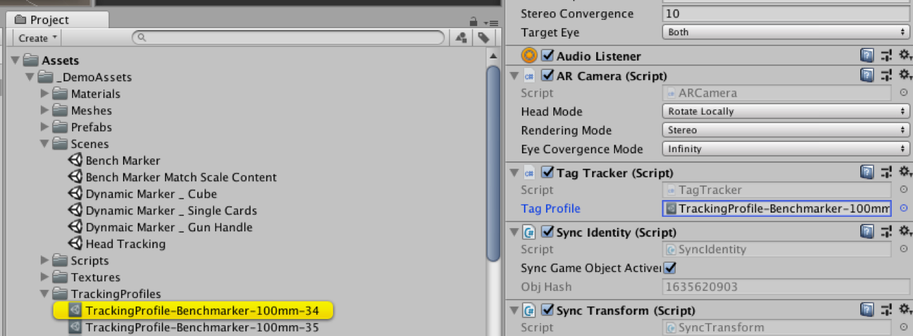

首先在场景中搭建基础的AR摄像头（参考上一小节）以及Bench Marker。

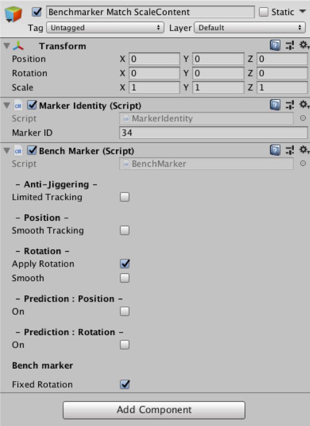

此时，已经建立了Tracking坐标系，同时坐标系原点也在Bench
Marker所在的(0,0,0)点。

此时我们创建一个Quad作为Bench
Marker的硬件指示物，调整x轴旋转为90度，同时赋予它的scale为
0.40x0.40x0.40，并且使其成为Bench Marker的子对象。

Quad 为比例为1m的物体，缩放尺寸为 0.40m (硬件实际尺寸) / 1m
(Quad实际尺寸) = 0.40m即可。

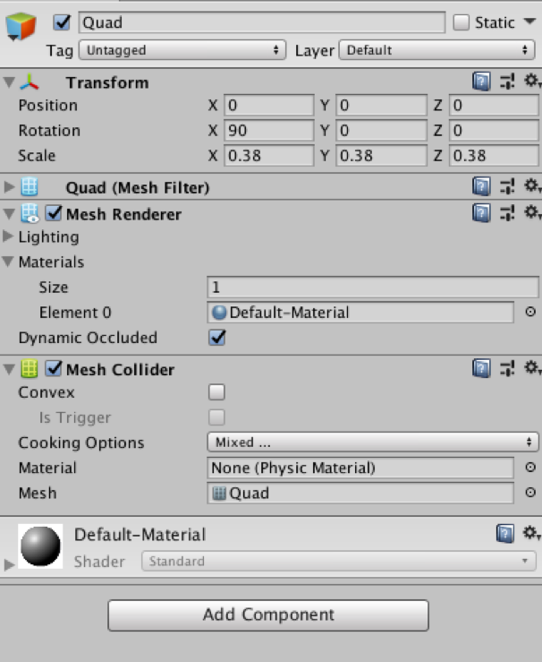

此时我们将准备好的素材放置到场景中，这是一个约为10m\*10m的房子，可以看到与实际Marker相比是非常大的。

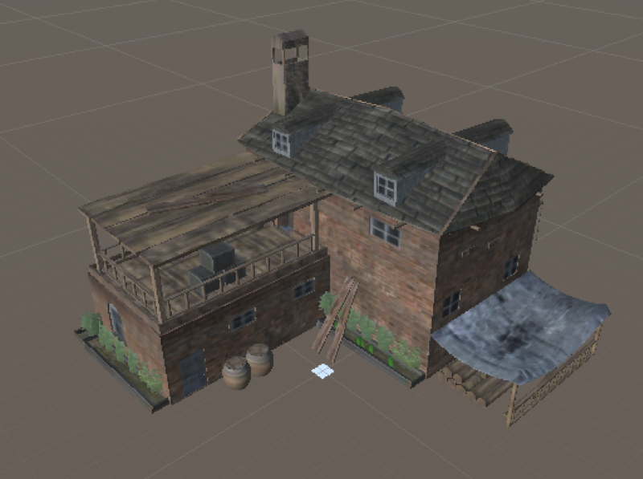

我们的目标是希望这个房子能在扫描追踪的时候，比例正确的贴合在marker上，所以我们要将tracking
坐标系进行缩放。而因为有Bench Marker的存在，我们缩放的时候直接调整Bench
Marker的大小就可以了。

因为我们之前制作了一个Marker物理尺寸的映射Quad在虚拟场景中，它可以给我们一个很好的缩放参考。

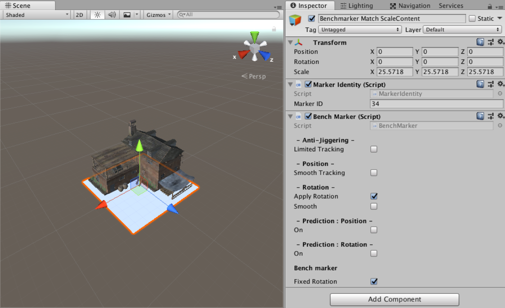

因此，我们将Bench Marker
物体整体放大，直至映射物理尺寸的Quad指示物刚好能覆盖整个房子为止，接着再细微调节房子的位置，使其完全贴合。

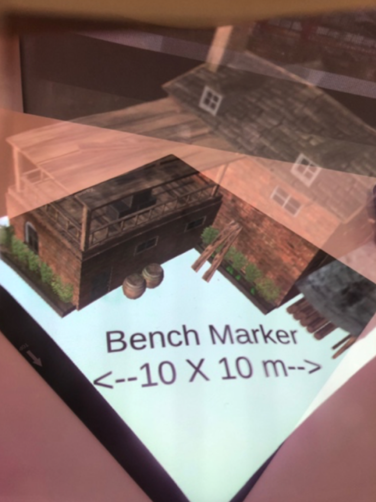

至此，我们完成了以Bench Marker 为基础的Trakcing坐标系的缩放调整。

## Dynamic Marker
--------------

Dynamic Marker\` 是用于追踪指定的Marker并获取其相对的姿态信息。

不同于Bench Marker
是处于建立的坐标系的原点，自身的姿态不会发生改变，Dynamic Marker
本身的Marker Target会每帧根据追踪的Marker更新自己的姿态信息。

因此如果我们如果需要虚拟视图根据Marker的姿态同步变化，就可以直接将Marker的虚拟视图直接放置到Marker
Target下座位Marker Target的子物体。

!\> 需要注意的是，Dynamic Marker 的Marker Target
缩放属性应始终保持1x1x1，如果需要调整虚拟视图与硬件的比例情况，应直接对虚拟视图进行缩放。

下面我们使用Dynamic Marker \_ Single Cards 这个场景来进行举例说明：

首先我们在Main Camera 的Tag Tracker 上能看到我们当前使用的Tracking
Profile是多个单marker的组合

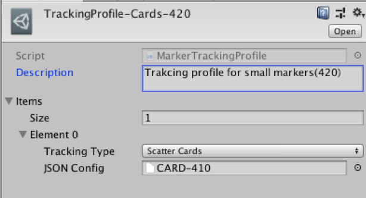

选择其中任意一个Marker Target，看到当前marker 的id 是 0。

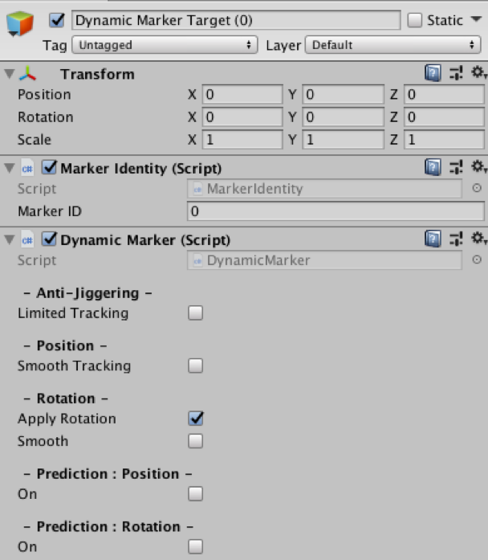

查看硬件id 为420-001的marker卡面，测量其物理尺寸可得0.04m \* 0.04m。

建立一个Quad作为Marker 的虚拟视图，将其放置于Dynamic Marker Target
层级之下，成为Marker Target的子物体。

为了贴合物理尺寸与虚拟视图尺寸，我们需要对虚拟视图进行缩放。

Quad 为比例为1m的物体，缩放尺寸为 0.04m (硬件实际尺寸) / 1m
(Quad实际尺寸) = 0.04m即可。

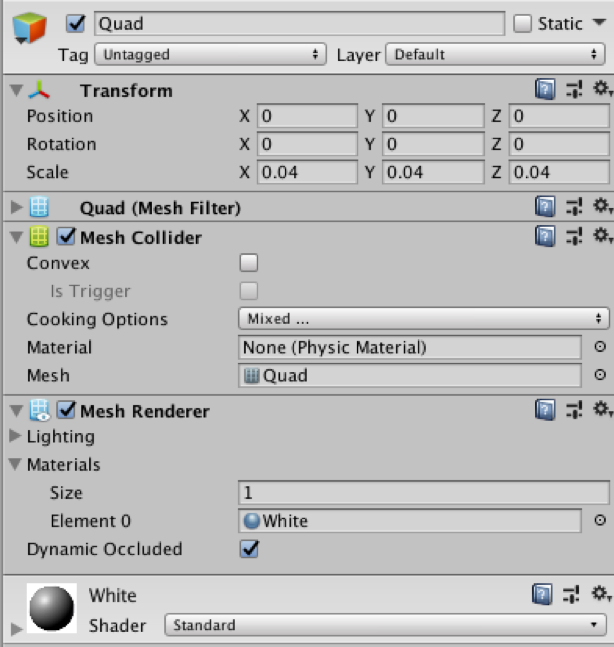

至此，Dynamic Marker的缩放已全部完成。

# Advanced SDK Guide

本章节将会在快速开始的基础上，进一步的解释详细的概念以及SDK的进阶用途。

## Concept and Components
----------

这里我们将会介绍一下实际开发中的会遇到的一些概念与约定名称。

## ARCamera
--------

AR摄像机是作用于在Unity场景中模拟人眼看到的信息。为了Marker的追踪以及视觉呈现的效果，场景中必须有一个附有Camera组件的GameObject，同时该GameObject上需要附有ARCamera以及Tag
Tracker两个组件。可以以Demo场景中的Camera设置作为参考。

## Marker Target
-------------

Marker Target 是硬件Marker在Unity虚拟场景中的载体容器。

在场景中新建一个空白的GameObject，为其添加Marker Identity以及Dynamic
Marker或者Bench Marker（二选一），就完成了Marker Target的创建了。

!\> 不管Marker类型是Bench Marker亦或是Dynamic Marker
，他们都可以使用scatter cards (单Marker)或者marker group (组合Marker)
的marker类型。

## Start From Scratch
--------

如果需要从头开始搭建一个真实开发场景，开发者可以遵循以下步骤：

1.  根据应用场景选择开所需的硬件设备，再这个示例中我们选择使用Cube

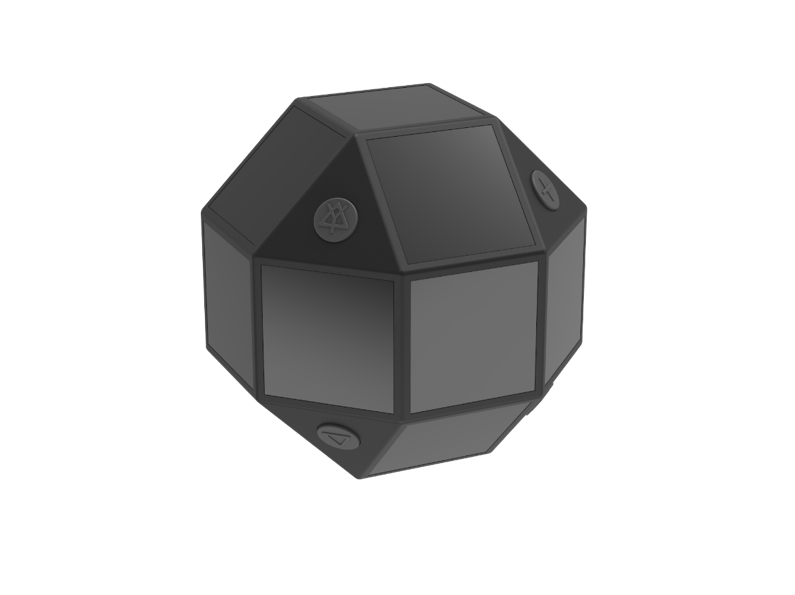

观察硬件的id 标签。

!\> 每个marker 硬件都会对应唯一个id

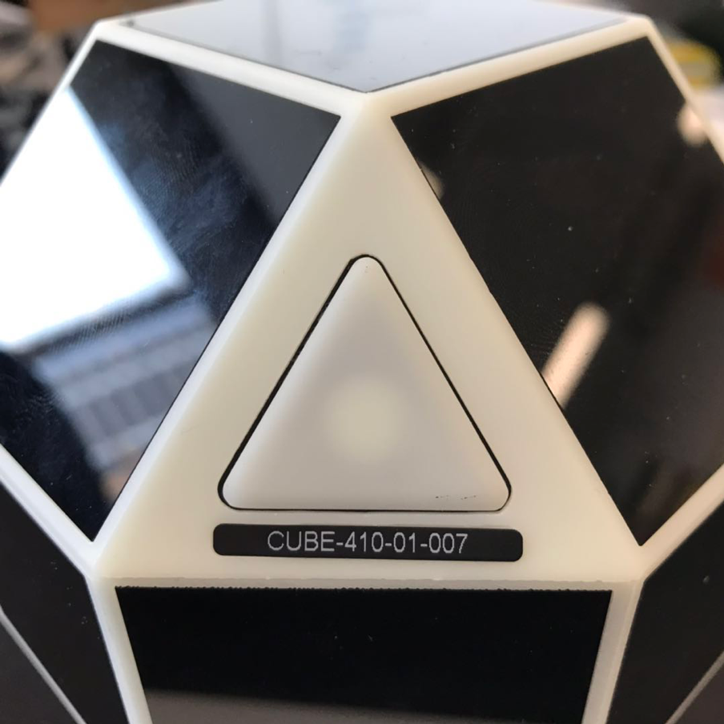

2.  打开Unity新建工程，按照[[上文]{.underline}](quickstart.md)中的指南导入SDK并且完成项目设置。

<!-- -->

3.  制作Tracking Profiles

在project
栏中任意目录下点击右键，在弹出的上下文窗口中选择Create/Ximmerse/SlideInSDK/Tracking
Profile 新建一个Tracking Profile。

你可以自定义Tracking Profile
文件的名字以及使用描述。在此示例中我们命名Demo Tracking Profile。

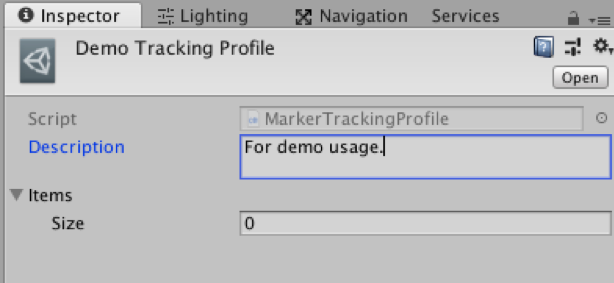

接下来我们添加标定文件到Tracking Profile
中。由于我们所使用的硬件是Cube，而Cube是一个组合型追踪目标，所以我们的标定文件是添加Marker
Group 类型。Config 一栏我们则使用与硬件id一致 为cube-410-01-007
的json配置文件。

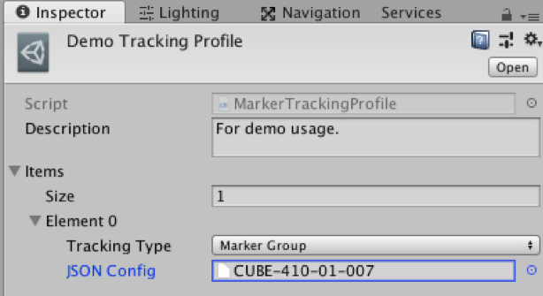

至此，我们就完成Tracking Profile 的创建。

4.  新建场景，在场景中搭设所需要的组件。

-   AR Camera

在Main Camera上增加AR Camera 以及Tag Tracker 两个组件。Tag Tracker
的Tracking Profile 使用我们刚刚创建的Profile。

5.  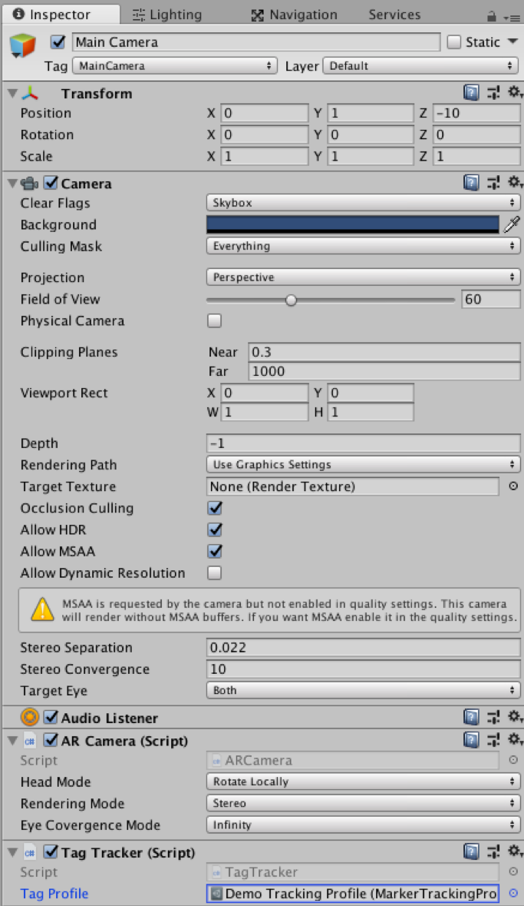

-   Dynamic Marker

建立完AR Camera 后，我们需要添加Marker Target 以确保Marker
能追踪并且使用其位置信息。

创建一个GameObject，将其命名为Cube Dynamic Marker Target。为其添加Marker
Identity 和Dynamic Marker 两个组件。

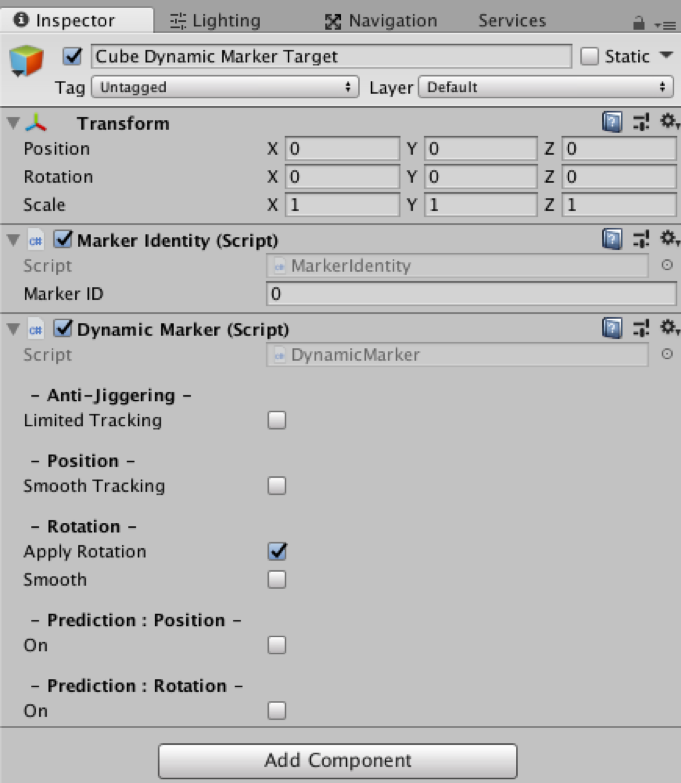

此时我们需要查找Cube 所对应的Marker Id， 然后将其填入Marker Identity
对应的字段中。

我们可以从配置的Tracking Profile 中的Json Config 中找到。

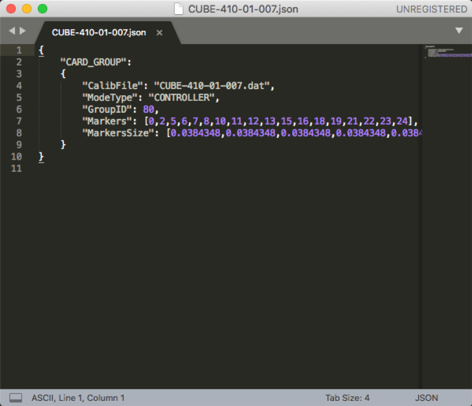

所以我们将Marker id，这里是GroupID **80** 填入Marker Identity 的Marker
Id 字段中。

至此基础的Marker追踪以及摄像机渲染设置完成。

6.  根据应用需求，构建虚拟视图。

在这个实例当中，我们会建立一个简单的球型视图作为虚拟视图。但用户透过头显观察Cube
的时候，会看到一个红色的球体取替了Cube的位置。

首先我们在Marker Target 下建立新的空白子物体，命名为View Root，由于Cube
的物理尺寸在半径0.11m左右， 我们将View Root 的缩放调整成0.11。

然后我们在View Root 下建立新的Sphere
子物体，新建一个红色材质球赋予给这个sphere即可。

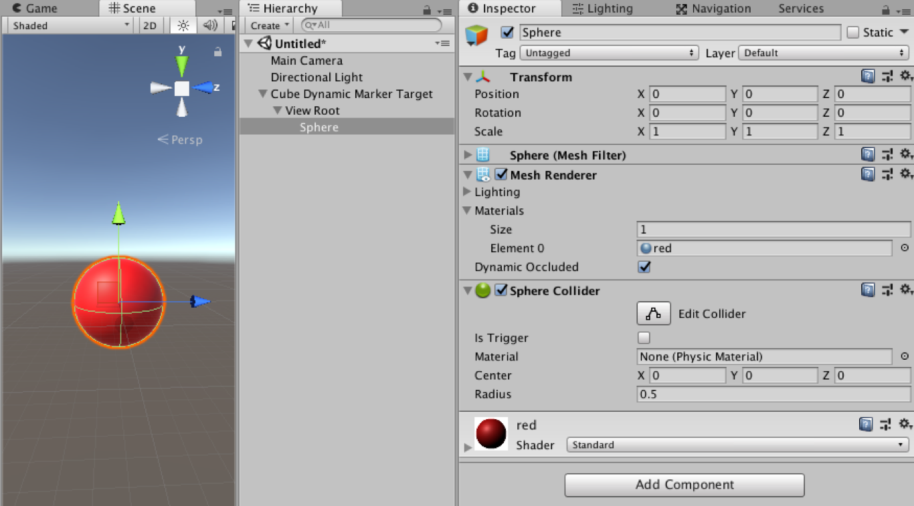

至此，虚拟视图的设置完成。

7.  添加测试、调试工具。（可选）

为了能更加方便的调试，我们建议加入一下工具方便调试。

-   PE Network Sync Transform / Properties

请参考[[此处]{.underline}](notdoneyet.md)查阅详细用法

-   [[LunarConsole]{.underline}](https://assetstore.unity.com/packages/tools/gui/lunar-mobile-console-free-82881)

在Project 一栏搜索Lunar Console 这个Prefab，并且将其置入场景中。

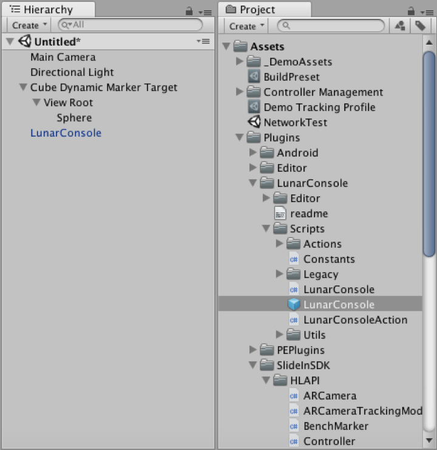

8.  打包测试。

将这个场景保存到资源中，并在Build Settings中添加此场景。

按照流程打包成sdk即可进行测试。

## Customized Build Preset
------------------

Build Preset 是PE Plugins 中的Build Manager 所使用的快速设置Build
Settings 配置文件。

我们开始新建一个自定义的Build Preset，首先进入Tools/PolyEngine/Build
Manager 打开Build Manager的窗界面。

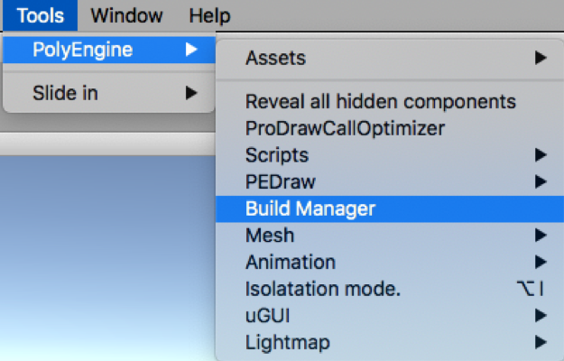

点击New Preset 按钮并且为新的Preset 输入一个名称，在这里我们设置为Demo
Preset。

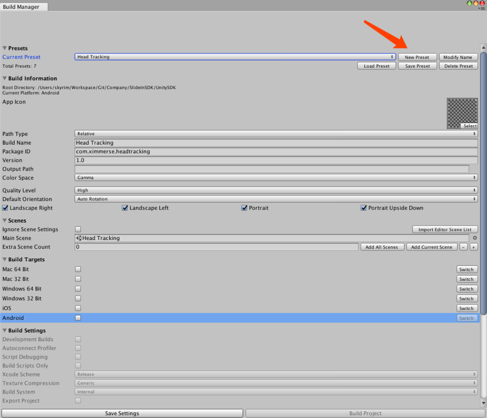

选择并加载我们建立的Preset，这个时候我们可以设置对应Player Settings
中的内容，这里我们举例几个常用项进行说明：

-   Build Name

最终apk安装后显示的应用名称。

-   Package ID

apk的唯一id，一般是com.开头。

-   Default Orientation

设备的默认旋转方向。

!\> 在Slide-In 的应用场景中中，我们的必须直接选择**Landscape
Right**这个选项。

-   Scenes

对应在Build Settings 中会打包进apk 的场景。

设置完成Preset 后，我们需要点击Save Preset 按钮进行保存。

至此，自定义Build
Preset的设置全部完成，之后我们就可以快速切换打包设置了。

7.1 单手柄使用场景配置说明

7.2 独立单人观察式场景配置说明

7.3 单人双手柄配置说明

7.4 Cube场景配置说明

7.5 双人观察式场景说明

7.6 多人交互式场景配置说明
