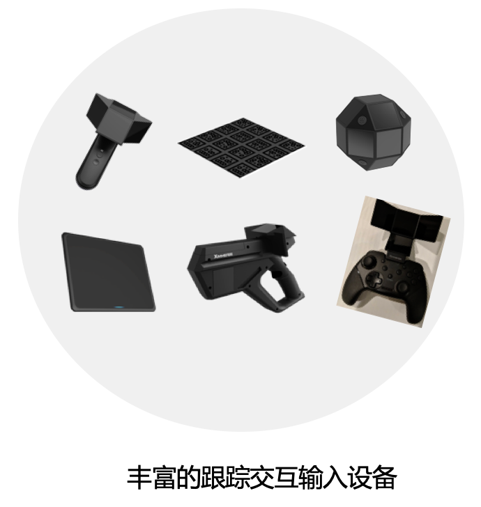
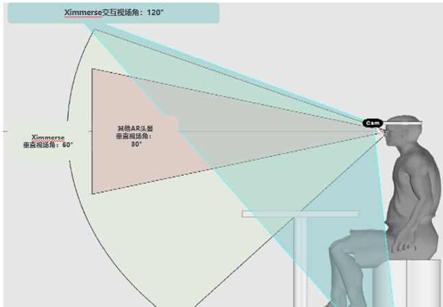
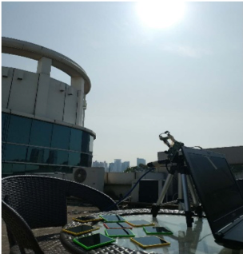
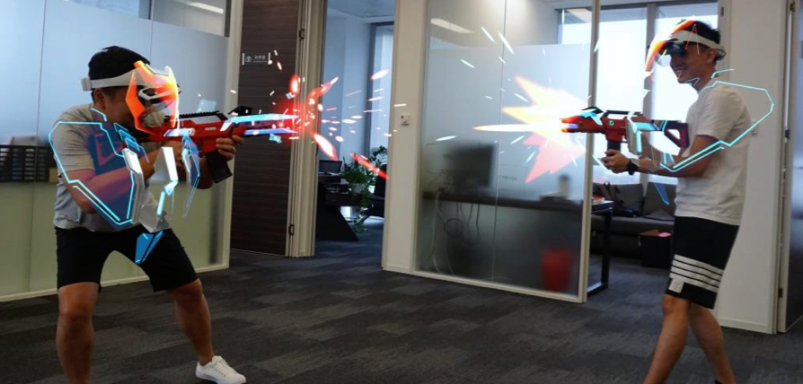

# System Introduction

> Rhino-X is an augmented reality system that enables rich 3D interactions with a headset and cuztomizable interactive controller devices. 
>
> 
> 

**Image 1. HMD and Controller Devices**

> Rhino-X is an augmented device that utilizes **free-form reflective lens** technology. The lens can be **magnetically** attached to the HMD. The system utilizes **Ximmerse custom anti-distortion algorithm**, stereoscopic rendering, Asynchronous TimeWarp, providing **low latency**, **high stability**, **high resolution**, **wide FOV**.

**Image 2. Wide FOV**

> Rhino-X uses **Snapdragon 835 SLAM Tracking** to provide 6DoF tracking. **Ximmerse x-Tag interaction system** enables rich interactions.
> Anchors are used to define interaction space. The system also supports multiplayer mode.
>
> 

**Image 3. World Anchor Space Definition**

> 
>
> **Image 4. Input Devices**
>
> 
>
> **Image 5. Multiplayer Support**
>
> Rhino-X utilizes X-Tag interaction system, enabling Marker tracking and 6DoF tracking with a single camera. The system is low-cost, easily maintainable, strong anti-interference and flexible. Developers can design different applications with different custom marker placement. 
>
> 
> 

**Image 6. Stable Tracking Game Refference**

**Image 7. Portable**

> Rhino-X
> AR system can be used in a lot of industries, such as medical, education, vocational training and entertainment industry.

**Image 8. Medical Industry**

**Image 9. Education Industry**

**Image 9. Manufacture Industry**

**Image 10. Entertainment Industry**